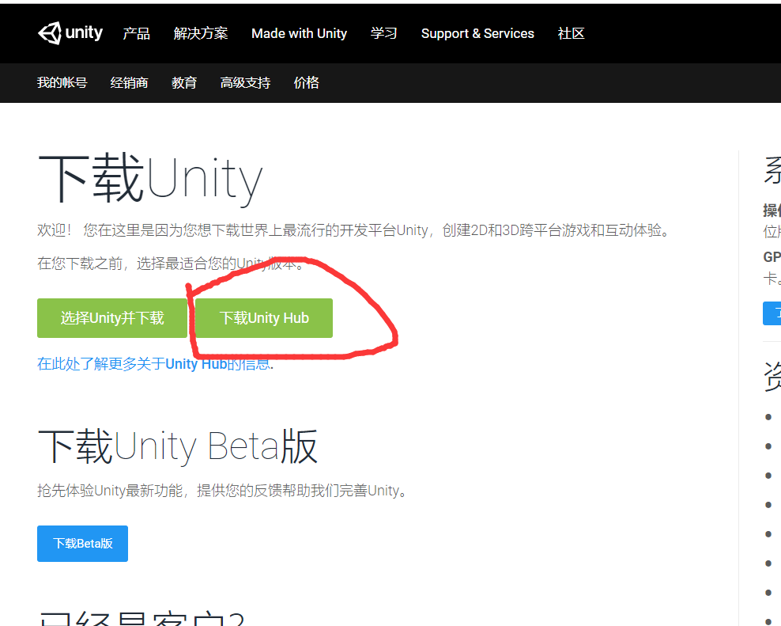
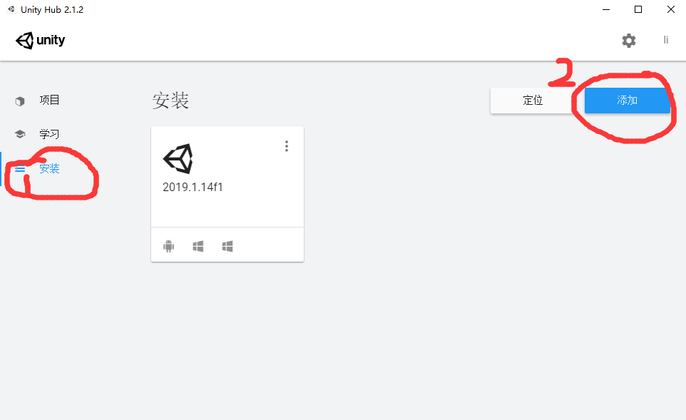
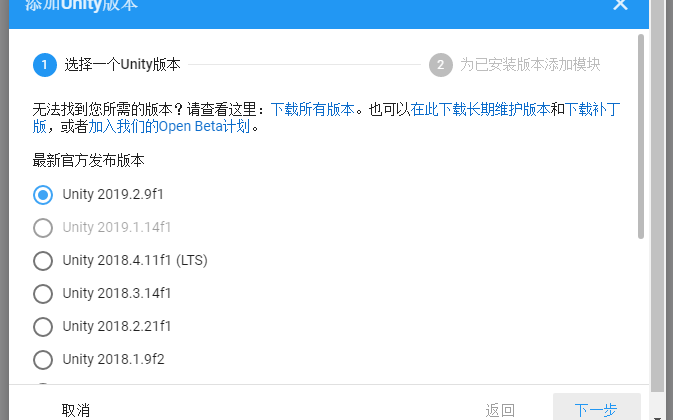
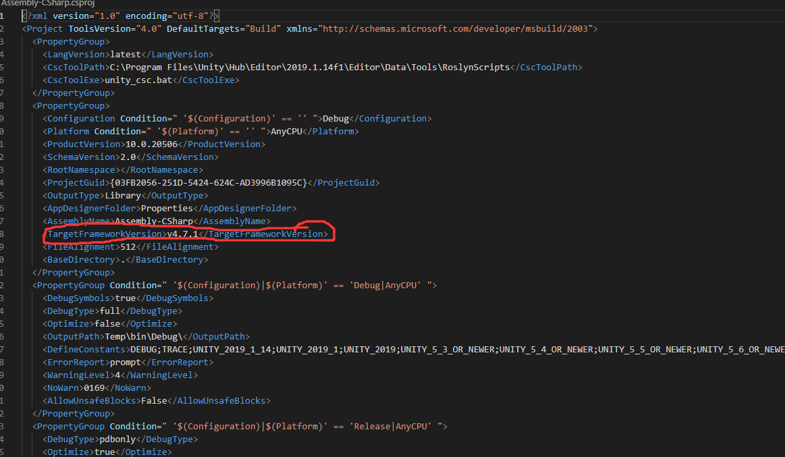

#

1、 进入[Unity下载界面](https://unity3d.com/cn/get-unity/download)，选择安装Unity Hub，

2、安装好Unity Hub之后，打开Unity Hub，选择安装Table页，点击添加按钮

3、 选择对应Unity版本安装

4、 选择Unity要安装的模块并完成安装。
    如果不选择Unity Hub 安装Unity，可以直接进入[Unity版本存档界面](https://unity3d.com/cn/get-unity/download/archive),选择对应版本进行下载并安装。每个版本的发行说明有相关的安装环境需求，满足相应环境需求，才可以进行正常开发。

5、安装代码编辑器，[Visual Studio](https://visualstudio.microsoft.com/zh-hans/vs/community/) 或 [Visual Studio Code](https://code.visualstudio.com/),Mac 系统下需要安装[mono](https://www.mono-project.com/),用来支持.Net的跨平台运行；不同版本的Unity生成的项目需要安装对应版本的[.NetFramework](https://dotnet.microsoft.com/download/dotnet-framework),版本信息可查看项目文件夹下Assembly-CSharp.csproj

6、安装 Visual Studio Code 下插件，C#、Debugger for Unity,如果在编辑器下没有联想提示，请安装步骤5中对应.NetFramework。
